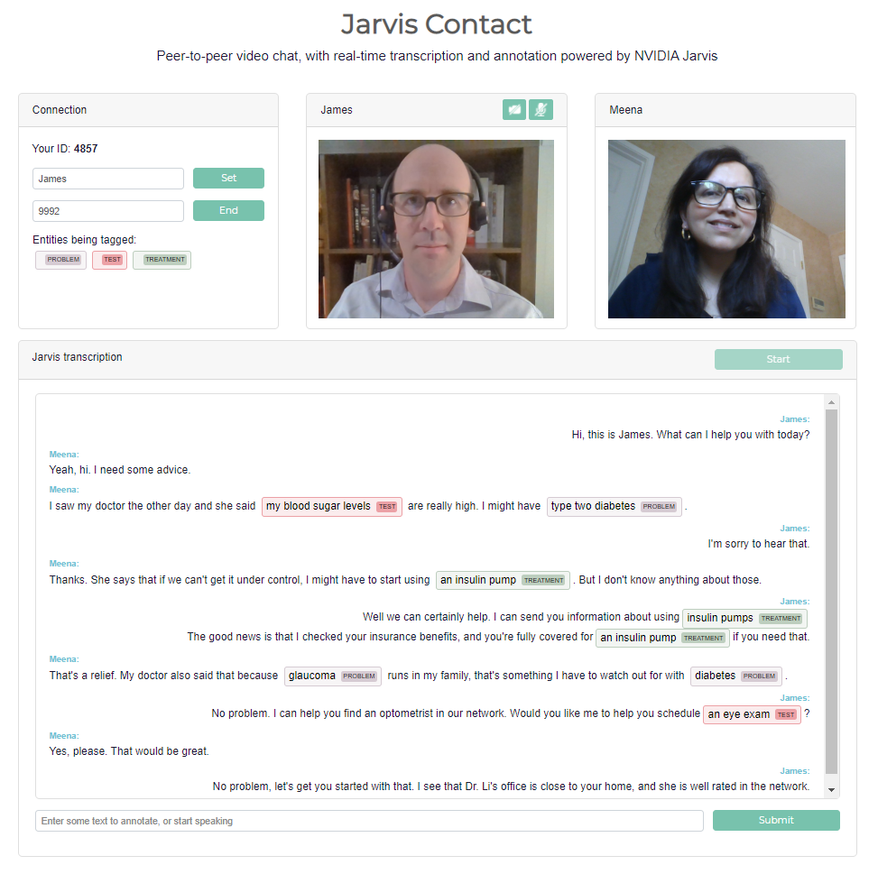

# Jarvis Contact

Jarvis Contact is a web-based demonstration app for contact center applications, combining peer-to-peer video chat with streaming automatic speech recognition (ASR) and natural language processing (NLP). It is a lightweight Node.js application, backed by robust NVIDIA Jarvis AI Services.



Users can chat using a direct, peer-to-peer WebRTC-based video connection. In the background, each user's web client sends a separate audio stream to the Jarvis Contact server. The server makes a streaming gRPC call to hosted Jarvis AI Services, which return an ongoing stream of ASR transcripts. This stream of transcripts is handed back to the speaker's web client, who can see how the in-progress results may change as they speak.

When ASR results are marked as "final" (typically during short pauses in speech), the server hands the resulting transcript over to the NLP service for named entity recognition (NER). If Jarvis is configured to use a general-domain NER model, the service will recognize entities like the name of a *person*, *location*, or *organization*. Jarvis can also be deployed with an NER model fine-tuned by NeMo for a specific domain. In this case, a model tuned on biomedical or clinical language might recognize entities such as *problem*, *test*, or *treatment*.

Once the NER results are complete, the Jarvis Contact server returns the final transcript, along with its NER annotation, back to the web client, which exchanges transcripts with the other user for an ongoing, annotated transcript of the conversation.

We hope this application offers a launching pad for your own development. One possibility would be to use the transcripts and tagged entities for downstream analytics and visualization. We encourage you to experiment, and would love to hear about what you build.


## Requirements

Jarvis Contact is a Node.js application, intended to run in a Linux environment. It requires Jarvis AI Services to be running with two primary models:

- Streaming ASR
- Named Entity Recognition

You are welcome to use the default Jarvis models offered in the Quick Start configuration, or you may deploy your own custom models trained using [NVIDIA NeMo](https://developer.nvidia.com/nvidia-nemo) and imported into Jarvis. Jarvis Contact comes pre-configured to use the models from Jarvis Quick Start. See the Jarvis AI Services documentation for more details.

## Installation

Installing Jarvis Contact can be done in one of two ways, either by installing from the repository or through the Jarvis Client docker container.

### Installing from the repository

First, clone the repository from Gitlab:

```
$ git clone https://gitlab-master.nvidia.com/cparisien/jarvis-contact.git
```

Install the required Node.js modules using the Node Package Manager (you might need to [install Node.js](https://nodejs.org/en/) itself if you haven't already):

```
$ cd jarvis-contact
$ npm install
```

Jarvis Contact uses environment variables to manage its configuration parameters. These are kept in the config file `env.txt`, where you will want to set the URL of your running Jarvis AI Services. You may also wish to change the application's ports, or the name of the NER model if you've deployed your own custom model in Jarvis.

Depending on your server environment, you will likely also need to open two ports on the server (by default, ports 8009 and 9000). These ports are for the main entry point to the web application, and for the [PeerJS server](https://github.com/peers/peerjs-server) which helps to negotiate the peer-to-peer chat connections. You may also need to set up port forwarding for these in your router, if applicable.

### Optional UMLS concept mapping

The code base includes in-progress functionality for healthcare applications, to link named entities with concepts in the [Unified Medical Language System](https://uts.nlm.nih.gov/home.html) (UMLS), a large medical ontology. Note that this feature is in development and thus doesn't work all that well just yet.

The feature relies on two external services: a copy of UMLS, and a running instance of quickUMLS, which does a lexical similarity search. Installation requires a few extra steps that we expect to simplify before this feature is released to the wild. We are using Hoo Chang Shin's local wrap of [UMLS and tools](https://gitlab-master.nvidia.com/hshin/umls-mapper).

Pull the UMLS docker container from NGC, then run it:

```
$ docker pull nvcr.io/ea-jarvis-megatron/umls-mapper
$ docker run --ipc=host --network host -p 4645:4645 -t nvcr.io/ea-jarvis-megatron/umls-mapper
```

Install quickUMLS:

```
$ pip install quickumls
```

Now, in the Jarvis Contact config file `env.txt`, uncomment the line `CONCEPT_MAP="UMLS"`. Note that this also won't do much unless you are running an NER model that recognizes medical named entities.

You can go ahead and start the app server, as below. If this is working, then when the NER model recognizes a term like `metformin`, you can mouse over the entity in the transcript to see the linked UMLS concept(s).


### Using the docker container

<TO DO, once the Jarvis Client container is ready.>

## Running the service

To start the web service, from the `jarvis-contact`  directory on your server, run:

```
$ npm run start
```

This will start the Node.js application, and will start listening for connections.

## Using the service

Load the URL in a browser (Chrome or Firefox work well) on a computer with a webcam and microphone. For best ASR results, a headset is recommended.

For example, if you're accessing the service from a computer within the local network, and it's hosted on a machine with the IP 192.168.2.10, then the URL would be https://192.168.2.10:8009/.

If you see a security warning, it's because we have included a self-signed certificate for demo purposes. We promise we're not doing anything nefarious. You can see the certificate in `jarvis-contact/certificates`. If you like, feel free to generate your own, or buy one from a trusted signing authority. You may "accept the risk" and continue.

When asked, give the website permission to access your webcam and microphone.

Once the page is loaded, you're welcome to start the Jarvis transcription without needing to make a video call. In the box titled "Jarvis transcription," hit the Start button, then start speaking. You'll see in-progress transcripts in the text field at the bottom. As those transcripts are finalized, they'll appear, with NLP annotations, in the transcription box. To test the NLP directly (without speaking), simply type into the text field at the bottom and hit Submit.

To call someone, you'll need their ID. Yours is the 4-digit number in the Connection box. It's random, and it changes every time the page is reloaded. Enter the ID of the person you wish to call, and click "Call." They will get a notification that a call is incoming, and will be asked to accept. Once you're connected, Jarvis transcription will start automatically if it's not already running.

The transcripts for each speaker are marked with the user's ID, or their display name if it has been set in the Connection box.

To end the call, simply close or reload the window.

